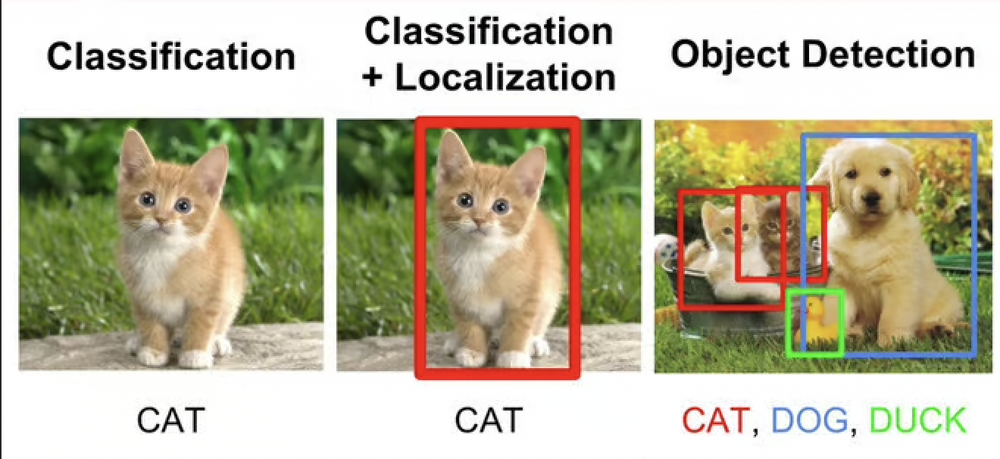
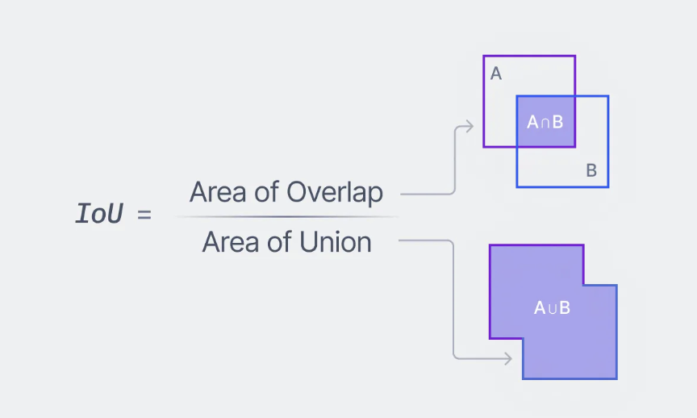
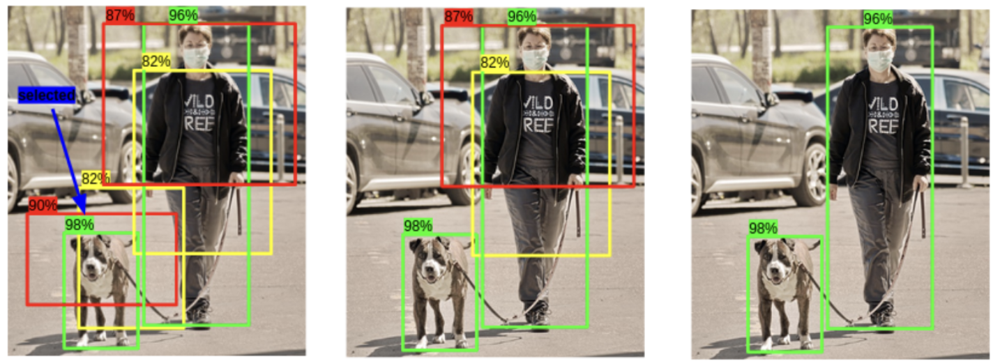
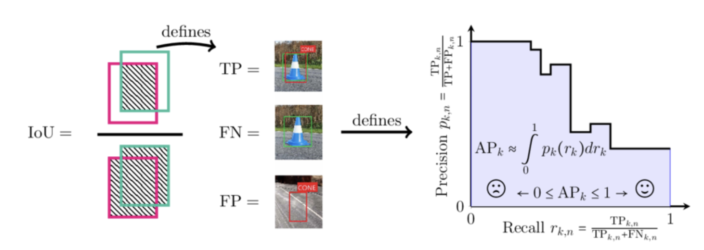

Object detection, a cornerstone of deep learning applications, continues to
evolve, fueled by innovative methodologies and robust implementations. Delving
into its intricacies sheds light on its historical progression, foundational
concepts, and crucial metrics. Here, we dissect the fundamental aspects and
emphasize the significance of advancements in non-max suppression and mean
average precision (mAP).

## Understanding the Basics

Object detection encompasses the identification and localization of multiple
objects within images, underpinning various domains such as autonomous vehicles
and medical imaging. This multifaceted process demands a nuanced understanding
of model architectures, bounding box representation, and evaluation metrics.

## Tracing Historical Progress

The journey of object detection is marked by a tapestry of innovation and
refinement. Researchers have introduced diverse model architectures and
methodologies, aiming to enhance accuracy, efficiency, and scalability. Notable
examples include YOLO and RCNN, each offering unique perspectives on object
detection.

## Distinguishing Localization from Detection

It is pivotal to differentiate between object localization and detection. While
localization entails pinpointing the precise location of a single object within
an image, detection extends this scope to identify multiple objects
concurrently, demanding robust algorithms and efficient computational
frameworks. 

## Navigating Challenges and Solutions

Despite remarkable progress, object detection encounters challenges such as
computational complexity and precise bounding box determination. Researchers
have devised innovative solutions, including sliding windows and regional-based
networks, to mitigate these obstacles and enhance the robustness of detection
algorithms.

## Intersection over Union (IoU)

The IoU metric plays a pivotal role in assessing the accuracy of bounding box
predictions. It facilitates precise evaluation by quantifying the overlap
between predicted and ground truth bounding boxes. Its versatility allows
compatibility with both corner and midpoint box formats, ensuring flexibility
and adaptability in diverse scenarios. 

## Non-Max Suppression (NMS)

Non-max suppression is a method used to refine bounding box predictions,
eliminating redundant detections and enhancing the precision of object
localization.

- Initially, the box with the highest probability of containing the object is
  chosen as the primary box. Then, an Intersection over Union (IOU) operation is
  conducted between this main box and the surrounding boxes. If the IOU value
  exceeds a predefined threshold, typically 0.5, indicating significant overlap,
  the surrounding box is removed as it likely predicts the same object as the
  main box.
- The rationale behind using an IOU threshold rather than directly removing all
  surrounding boxes is to address scenarios where identical or closely
  positioned objects are present. Deleting surrounding boxes solely based on
  proximity could lead to eliminating boxes representing distinct objects. By
  utilizing IOU, NMS ensures that only boxes highly likely to represent the same
  object as the main box are removed. 

## Mean Average Precision (mAP)

mAP is used to evaluate the performance of object detection models, providing
insights into both precision and recall. To understand mAP, one must grasp the
concept of AP (Average Precision), which in turn relies on precision and recall.
   Precision signifies the proportion of correctly detected results among
all results detected by the model, while recall, also known as recall rate,
refers to the proportion of correctly detected results among the results that
the model should detect. Evaluating performance based solely on precision or
recall can be misleading, as high precision may correspond to low recall and
vice versa.   To comprehensively assess model performance, precision and recall
values must be combined, typically visualized through a precision-recall (PR)
curve. This curve illustrates how precision varies with changes in recall as the
confidence threshold for detections is adjusted. AP, or Average Precision,
quantifies the area under the PR curve.    An AP of 1 indicates perfect object
detection performance, where both precision and recall are 1.

