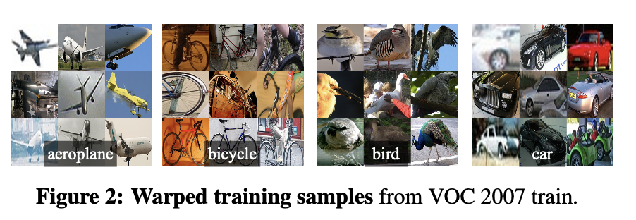

## Understanding R-CNN:

Region-based Convolutional Neural Network (R-CNN) is a deep learning
architecture utilized for object detection in computer vision tasks. It segments
the task into three core modules, streamlining the process of identifying
objects within images.

## Three Modules of R-CNN:

1. Region Proposal:

- R-CNN begins its process by segmenting the input image into multiple regions
  or subregions, which are commonly known as "region proposals" or "region
  candidates." This initial step aims to produce a collection of potential
  regions within the image that are likely to contain objects of interest.
- Notably, R-CNN does not undertake the task of generating these proposals
  internally; rather, it relies on external methods such as Selective Search or
  EdgeBoxes for this purpose.
- For instance, Selective Search utilizes a methodology that involves merging or
  splitting segments of the image, leveraging various image attributes such as
  color, texture, and shape, to generate a diverse and comprehensive set of
  region proposals.

2. Feature Extraction:

- The next step involves extracting approximately 2,000 regions, which are then
  anisotropically warped to a consistent input size compatible with the
  convolutional neural network (CNN) expectations, typically 224x224 pixels.
- Subsequently, these warped regions are passed through the CNN to extract
  features. Regardless of the size or aspect ratio of the candidate region, a
  tight bounding box is applied to warp all pixels to the required size
  uniformly.
- Before the warping process, the tight bounding box is dilated to ensure that
  at the warped size, there are precisely p pixels of warped image context
  surrounding the original box. Typically, a value of p = 16 is employed for
  this dilation process. Wraped training samples
  

3. Object Classification:

- The feature vectors extracted from the region proposals are directed into
  distinct machine learning classifiers dedicated to each object class of
  interest.
- R-CNN commonly employs Support Vector Machines (SVMs) for this classification
  task. For every class, a distinct SVM is trained to ascertain whether the
  region proposal contains an instance of that particular class.
- In the training phase, positive samples are representative of regions that
  encompass an instance of the class under consideration. Conversely, negative
  samples denote regions that do not contain such instances. This discrimination
  between positive and negative samples aids in the SVM's learning process to
  accurately classify the region proposals during inference.

## Bounding Box Regression and Non-Maximum Suppression (NMS):

- Bounding Box Regression: Apart from object classification, R-CNN incorporates
  bounding box regression as an essential component. For every class, an
  individual regression model is trained specifically to enhance the precision
  of object localization. This regression model works to refine the location and
  size of the bounding box surrounding the detected object. The bounding box
  regression mechanism aids in improving the accuracy of object localization by
  iteratively adjusting the initially proposed bounding box to align more
  closely with the actual boundaries of the object. This iterative refinement
  process enhances the overall performance of R-CNN by ensuring better alignment
  between predicted bounding boxes and the objects present in the image.
- NMS: Ensures final object detections by eliminating duplicate or overlapping
  bounding boxes, retaining only the most confident predictions.

## Challenges with R-CNN:

- Time-Intensive Training: Processing 2,000 region proposals per image leads to
  prolonged training times. Real-time
- Implementation Barrier: High computational demands hinder real-time object
  detection, limiting practical applications.
- Fixed Region Proposal Algorithms: Lack of adaptability in region proposal
  generation may yield suboptimal results, affecting overall detection
  performance.

## Proposed Solution: Introducing Fast R-CNN and Faster R-CNN:

- Fast R-CNN: Addresses efficiency issues by integrating region proposal and
  feature extraction stages into a single network, reducing computational
  overhead.
- Faster R-CNN: Further enhances speed and accuracy by introducing a Region
  Proposal Network (RPN) that learns to generate region proposals alongside
  feature extraction.

## Implementation:

https://github.com/SuyashSalvi/R-CNN_Object_detection
